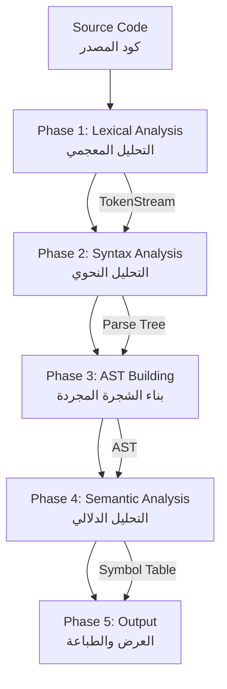

# تقرير مشروع ANTLR Multi-Language Compiler

## مقدمة

هاد المشروع هو مترجم (compiler) تعليمي متقدم، مبني باستخدام **ANTLR 4.13.2**. المشروع بيوضح كيف بنبني مترجم كامل من الصفر، ابتداءً من التحليل المعجمي ووصولاً للتحليل الدلالي وبناء شجرة AST.

### شو بيميز هاد المشروع؟

المشروع بيدعم لغتين مختلفتين كلياً:

1. **لغة شبيهة بـ Python** - لغة برمجة كاملة المواصفات فيها دوال، classes، list comprehensions، والخ
2. **قوالب Jinja2** - محرك قوالب متكامل مع دعم HTML و CSS

### التقنيات المستخدمة

- **ANTLR 4.13.2** - أداة لتوليد المترجمات (Parser Generator)
- **Java** - لغة البرمجة الأساسية
- **DenterHelper** - مكتبة للتعامل مع المسافات البادئة (indentation) على طريقة Python

---

## بنية المشروع

المشروع منظم بطريقة احترافية، كل قسم إلو وظيفة محددة:

```
antlr_course/
├── grammars/                      # ملفات القواعد النحوية (.g4)
│   ├── pythonLexer.g4            # المحلل المعجمي لـ Python
│   ├── pythonParser.g4           # المحلل النحوي لـ Python
│   ├── jinja2Lexer.g4            # المحلل المعجمي لـ Jinja2
│   └── jinja2Parser.g4           # المحلل النحوي لـ Jinja2
│
├── src/
│   ├── Main.java                  # نقطة الدخول الرئيسية
│   └── antlr/
│       ├── ast/                   # عقد شجرة AST (136+ كلاس)
│       │   ├── node/              # الكلاس الأساسي ASTNode
│       │   ├── python/            # عقد Python (~47 كلاس)
│       │   ├── jinja2/            # عقد Jinja2 (~60 كلاس)
│       │   └── css/               # عقد CSS (~30 كلاس)
│       │
│       ├── visitor/               # تطبيقات نمط الزائر
│       │   ├── ASTBuilder.java      # بناء AST لـ Python
│       │   ├── JinjaASTBuilder.java # بناء AST لـ Jinja2
│       │   └── ASTPrinter.java      # طباعة AST بألوان
│       │
│       ├── gen/                   # الكود المولد من ANTLR
│       │   ├── python/
│       │   └── jinja2/
│       │
│       └── symbol/                # التحليل الدلالي
│           ├── Symbol.java          # كلاس الرمز
│           └── SymbolTable.java     # جدول الرموز
│
├── tests/                         # ملفات الاختبار
│   ├── dictionary.py             # اختبار شامل لـ Python
│   └── flask/                    # مثال Flask + Jinja2
│       ├── app.py
│       └── templates/
│
├── dependencies/
│   └── antlr-4.13.2-complete.jar
│
└── antlr-denter-main/            # مكتبة DenterHelper
```

### شرح المجلدات الرئيسية

#### 📁 grammars/
هون بنحط ملفات `.g4` اللي بتعرّف قواعد اللغة. كل لغة بدها ملفين:
- **Lexer** - بيحدد كيف نقسم النص لـ tokens (كلمات، رموز، أرقام)
- **Parser** - بيحدد كيف نركب هالـ tokens لتكوين جمل صحيحة

#### 📁 src/antlr/ast/
هون موجودة كل كلاسات عقد الـ AST. في عندنا **136+ كلاس** موزعين على:
- **python/** - عقد خاصة بلغة Python
- **jinja2/** - عقد خاصة بـ Jinja2 وHTML
- **css/** - عقد خاصة بـ CSS

#### 📁 src/antlr/visitor/
الـ Visitors هن المسؤولين عن:
- تحويل Parse Tree لـ AST
- طباعة الـ AST بشكل مقروء

#### 📁 src/antlr/symbol/
هون موجود جدول الرموز (Symbol Table) اللي بيتتبع:
- المتغيرات وين تم تعريفها
- الدوال والـ classes
- النطاقات (Scopes) المتداخلة

---

## مراحل الترجمة (Compilation Pipeline)

المترجم بيشتغل على **5 مراحل متتالية**، كل مرحلة بتحول الكود لشكل أسهل للمعالجة:



### المرحلة 1️⃣: التحليل المعجمي (Lexical Analysis)

**شو بيصير؟**
- بناخد النص العادي ونقسمو لـ **tokens** (وحدات معجمية)
- كل token بيمثل كلمة محجوزة، رقم، رمز، أو اسم متغير

**مثال:**
```python
x = 10 + 5
```

**بيصير:**
```
[NAME]    'x'     (Line 1, Col 0)
[ASSIGN]  '='     (Line 1, Col 2)
[NUM]     '10'    (Line 1, Col 4)
[PLUS]    '+'     (Line 1, Col 7)
[NUM]     '5'     (Line 1, Col 9)
```

**ميزة خاصة للـ Python:**
المحلل المعجمي بيستخدم **DenterHelper** لتوليد tokens وهمية `INDENT` و `DEDENT` بناءً على المسافات البادئة. هيك بنقدر نفهم البلوكات (blocks) بدون أقواس.

**ميزة خاصة لـ Jinja2:**
المحلل فيه **7 أنماط (modes)** مختلفة بيتبدل بينهم حسب السياق:
- `DEFAULT_MODE` - محتوى HTML عادي
- `HTML_TAG` - داخل tag مثل `<div ...>`
- `STYLE_TAG` - داخل `<style>` attributes
- `CSS_CONTENT` - محتوى CSS داخل `<style>...</style>`
- `JINJA_STMT` - داخل ``
- `JINJA_EXPR` - داخل `{{ ... }}`
- `JINJA_COMMENT` - داخل `{# ... #}`

### المرحلة 2️⃣: التحليل النحوي (Syntax Analysis)

**شو بيصير؟**
- بناخد الـ tokens ونتأكد إنهم متطابقين مع قواعد اللغة
- بنبني **Parse Tree** (شجرة نحوية) بتمثل بنية الجملة

**مثال:**
```python
if x > 5:
    print(x)
```

**Parse Tree:**
```
IfStatementContext
├── IF: 'if'
├── ComparisonContext
│   ├── NAME: 'x'
│   ├── GT: '>'
│   └── NUM: '5'
├── COLON: ':'
└── BlockContext
    └── PrintStatementContext
        └── NAME: 'x'
```

**كشف الأخطاء:**
لو كان في خطأ نحوي (مثلاً نسينا `:` بعد if)، المرحلة هاي بتكتشفو وبتوقف الترجمة.

### المرحلة 3️⃣: بناء AST (Abstract Syntax Tree)

**شو بيصير؟**
- بنحول Parse Tree (المفصلة) لـ **AST** (مختصرة)
- الـ AST بتحتفظ بس بالمعلومات المهمة (بدون أقواس، نقاط فاصلة، الخ)

**كيف بيصير التحويل؟**
بنستخدم **Visitor Pattern** - الـ ASTBuilder بيمشي على Parse Tree وبينشئ عقد AST:

```java
public ASTNode visitIfStmt(IfStmtContext ctx) {
    // نستخرج الشرط
    ExpressionNode condition = (ExpressionNode) visit(ctx.expression());

    // نستخرج البلوك
    BlockNode block = (BlockNode) visit(ctx.block());

    // ننشئ عقدة if
    return new IfStatementNode(condition, block, ctx.getStart().getLine());
}
```

**النتيجة (AST):**
```
IfStatementNode [line 1]
├── condition: ComparisonNode (>)
│   ├── VariableNode: x
│   └── NumberIntegerNode: 5
└── BlockNode
    └── PrintNode
        └── VariableNode: x
```

### المرحلة 4️⃣: التحليل الدلالي (Semantic Analysis)

**شو بيصير؟** (بس لـ Python)
- بنبني **Symbol Table** - جدول بكل المتغيرات والدوال
- بنتتبع **النطاقات (Scopes)** - كل دالة إلها نطاقها الخاص
- بنتأكد من إنو المتغيرات معرفة قبل استخدامها

**مثال على جدول الرموز:**

لو عندنا كود:
```python
def calculate(x, y):
    result = x + y
    return result

total = calculate(10, 5)
```

**جدول الرموز:**
```
┌─────── Global Scope (level 0) ───────┐
│ Name       Type        Line  Col     │
├──────────────────────────────────────┤
│ calculate  FUNCTION    1     4       │
│ total      VARIABLE    5     0       │
│                                      │
│ ┌─── function_calculate (level 1) ──┐
│ │ x        PARAMETER   1     14     │
│ │ y        PARAMETER   1     17     │
│ │ result   VARIABLE    2     4      │
│ └───────────────────────────────────┘
└──────────────────────────────────────┘
```

**ليش هالشي مهم؟**
- لو استخدمنا متغير قبل ما نعرفو، جدول الرموز بيكتشف الخطأ
- بيساعدنا نفهم وين كل متغير متعرف ووين بنقدر نستخدمو

### المرحلة 5️⃣: العرض (Output)

**شو بيصير؟**
- بنطبع الـ AST بشكل شجري ملون
- بنطبع جدول الرموز بشكل جدول منظم
- بنستخدم ANSI colors عشان يكون العرض واضح

**مثال الخرج:**
```
🌳 Abstract Syntax Tree:
ProgramNode
├── FunctionDefinitionNode [line 1]
│   ├── name: calculate
│   ├── RegularParamNode: x
│   ├── RegularParamNode: y
│   └── BlockNode
│       ├── AssignmentNode [line 2]
│       │   ├── target: result
│       │   └── BinaryOpNode (+)
│       └── ReturnNode
│           └── VariableNode: result
└── AssignmentNode [line 5]
    ├── target: total
    └── FunctionCallNode: calculate
```

---

## مخطط بنية AST - Python

الـ AST بتتكون من عقد (nodes) منظمة بشكل هرمي. كل عقدة بتمثل جزء من الكود.

```mermaid
classDiagram
    class ASTNode {
        <<abstract>>
        +String nodeName
        +int lineNumber
        +int columnNumber
        +accept(visitor)
        +getChildren()
    }

    class ProgramNode {
        +List~StatementNode~ statements
    }

    class StatementNode {
        <<abstract>>
    }

    class ExpressionNode {
        <<abstract>>
    }

    class AssignmentNode {
        +String targetName
        +ExpressionNode value
    }

    class IfStatementNode {
        +ExpressionNode condition
        +BlockNode thenBlock
        +BlockNode elseBlock
    }

    class ForStatementNode {
        +String variable
        +ExpressionNode iterable
        +BlockNode body
    }

    class WhileStatementNode {
        +ExpressionNode condition
        +BlockNode body
    }

    class FunctionDefinitionNode {
        +String name
        +List~ParameterNode~ parameters
        +BlockNode body
    }

    class ClassDefinitionNode {
        +String name
        +String parentClass
        +BlockNode body
    }

    class NumberIntegerNode {
        +int value
    }

    class StringNode {
        +String value
    }

    class ListNode {
        +List~ExpressionNode~ elements
    }

    class BinaryOpNode {
        +Operator op
        +ExpressionNode left
        +ExpressionNode right
    }

    class VariableNode {
        +String name
    }

    class FunctionCallNode {
        +String functionName
        +List~ExpressionNode~ arguments
    }

    ASTNode <|-- ProgramNode
    ASTNode <|-- StatementNode
    ASTNode <|-- ExpressionNode

    StatementNode <|-- AssignmentNode
    StatementNode <|-- IfStatementNode
    StatementNode <|-- ForStatementNode
    StatementNode <|-- WhileStatementNode
    StatementNode <|-- FunctionDefinitionNode
    StatementNode <|-- ClassDefinitionNode

    ExpressionNode <|-- NumberIntegerNode
    ExpressionNode <|-- StringNode
    ExpressionNode <|-- ListNode
    ExpressionNode <|-- BinaryOpNode
    ExpressionNode <|-- VariableNode
    ExpressionNode <|-- FunctionCallNode
```



### تفصيل عقد Python AST

#### 🔹 عقد الجمل (Statement Nodes)

| العقدة | الوصف | مثال |
|--------|-------|------|
| **AssignmentNode** | إسناد قيمة لمتغير | `x = 10` |
| **PrintNode** | طباعة قيمة | `print(x)` |
| **ReturnNode** | إرجاع قيمة من دالة | `return x + 1` |
| **IfStatementNode** | جملة شرطية | `if x > 5: ...` |
| **ForStatementNode** | حلقة for | `for i in range(10): ...` |
| **WhileStatementNode** | حلقة while | `while x > 0: ...` |
| **BreakNode** | كسر حلقة | `break` |
| **ContinueNode** | متابعة حلقة | `continue` |
| **FunctionDefinitionNode** | تعريف دالة | `def foo(x): ...` |
| **ClassDefinitionNode** | تعريف class | `class MyClass: ...` |
| **ImportStatement** | استيراد | `from math import sqrt` |

#### 🔹 عقد التعابير - القيم الثابتة (Literals)

| العقدة | الوصف | مثال |
|--------|-------|------|
| **NumberIntegerNode** | عدد صحيح | `42` |
| **NumberDoubleNode** | عدد عشري | `3.14` |
| **StringNode** | نص | `"hello"` |
| **BooleanNode** | قيمة منطقية | `True`, `False` |
| **NoneNode** | قيمة فارغة | `None` |
| **ListNode** | قائمة | `[1, 2, 3]` |
| **DictNode** | قاموس | `{"key": "value"}` |

#### 🔹 عقد التعابير - العمليات (Operations)

| العقدة | الوصف | أمثلة |
|--------|-------|-------|
| **BinaryOpNode** | عمليات ثنائية حسابية | `+`, `-`, `*`, `/`, `**`, `%`, `//` |
| **UnaryOpNode** | عمليات أحادية | `+x`, `-x` |
| **ComparisonNode** | عمليات مقارنة | `==`, `!=`, `<`, `>`, `<=`, `>=`, `in`, `not in` |
| **LogicalOpNode** | عمليات منطقية | `and`, `or`, `not` |

#### 🔹 عقد التعابير - الوصول (Access)

| العقدة | الوصف | مثال |
|--------|-------|------|
| **VariableNode** | متغير | `x` |
| **DotAccessNode** | وصول بالنقطة | `obj.attribute` |
| **IndexAccessNode** | وصول بالفهرس | `list[0]` |
| **FunctionCallNode** | استدعاء دالة | `foo(x, y)` |

#### 🔹 عقد متقدمة

| العقدة | الوصف | مثال |
|--------|-------|------|
| **ListComprehensionNode** | list comprehension | `[x*2 for x in range(10)]` |
| **ParenExprNode** | تعبير بأقواس | `(x + y) * z` |

#### 🔹 عقد معاملات الدوال (Parameter Nodes)

| العقدة | الوصف | مثال |
|--------|-------|------|
| **RegularParamNode** | معامل عادي | `def foo(x, y=10)` |
| **StarArgsNode** | معامل *args | `def foo(*args)` |
| **KwargsNode** | معامل **kwargs | `def foo(**kwargs)` |
| **KeywordOnlyParamNode** | معامل keyword-only | `def foo(*, x, y)` |
| **PositionalOnlyParamNode** | معامل positional-only | `def foo(x, /, y)` |

---

## مخطط بنية AST - Jinja2

قوالب Jinja2 أعقد من Python لأنها بتجمع 3 لغات بملف واحد: Jinja2 + HTML + CSS

```mermaid
classDiagram
    class ASTNode {
        <<abstract>>
    }

    class TemplateNode {
        +List~ASTNode~ content
    }

    class HtmlTextNode {
        +String text
    }

    class HtmlElementNode {
        <<abstract>>
        +String tagName
        +List~HtmlAttributeNode~ attributes
    }

    class NormalHtmlElementNode {
        +List~ASTNode~ children
    }

    class VoidHtmlElementNode {
    }

    class ForBlockNode {
        +TargetNode target
        +JinjaExpressionNode iterable
        +List~ASTNode~ body
        +List~ASTNode~ elseBody
    }

    class IfBlockNode {
        +JinjaExpressionNode condition
        +List~ASTNode~ thenBody
        +List~ElifBranchNode~ elifBranches
        +List~ASTNode~ elseBody
    }

    class MacroNode {
        +String name
        +List~MacroParamNode~ parameters
        +List~ASTNode~ body
    }

    class BlockDefinitionNode {
        +String name
        +List~ASTNode~ content
    }

    class ExpressionBlockNode {
        +JinjaExpressionNode expression
        +List~FilterNode~ filters
    }

    class SetStatementNode {
        +TargetNode target
        +JinjaExpressionNode value
    }

    class ImportNode {
        +String template
        +String alias
    }

    class CSSStylesheetNode {
        +List~CSSRuleNode~ rules
    }

    class CSSRuleNode {
        +CSSSelectorNode selector
        +List~CSSDeclarationNode~ declarations
    }

    ASTNode <|-- TemplateNode
    ASTNode <|-- HtmlTextNode
    ASTNode <|-- HtmlElementNode
    ASTNode <|-- ForBlockNode
    ASTNode <|-- IfBlockNode
    ASTNode <|-- MacroNode
    ASTNode <|-- BlockDefinitionNode
    ASTNode <|-- ExpressionBlockNode
    ASTNode <|-- SetStatementNode
    ASTNode <|-- ImportNode
    ASTNode <|-- CSSStylesheetNode

    HtmlElementNode <|-- NormalHtmlElementNode
    HtmlElementNode <|-- VoidHtmlElementNode
```



### تفصيل عقد Jinja2 AST

#### 🔹 عقد المحتوى (Content Nodes)

| العقدة | الوصف | مثال |
|--------|-------|------|
| **TemplateNode** | القالب الكامل | جذر الشجرة |
| **HtmlTextNode** | نص HTML عادي | `<p>Hello World</p>` النص: "Hello World" |
| **HtmlElementNode** | عنصر HTML | `<div>...</div>` |
| **HtmlAttributeNode** | خاصية HTML | `class="container"` |

#### 🔹 عقد HTML المتخصصة

المشروع بيدعم عناصر HTML محددة كل واحد إلو كلاس خاص:

**عناصر بنية المستند:**
- `HtmlRootHtmlNode` - `<html>`
- `HeadHtmlNode` - `<head>`
- `BodyHtmlNode` - `<body>`
- `TitleHtmlNode` - `<title>`

**عناصر النص والتنسيق:**
- `DivHtmlNode` - `<div>`
- `ParagraphHtmlNode` - `<p>`
- `H1HtmlNode` - `<h1>`
- `AnchorHtmlNode` - `<a>`

**عناصر النماذج:**
- `FormHtmlNode` - `<form>`
- `InputHtmlNode` - `<input>` (void element)
- `ButtonHtmlNode` - `<button>`
- `LabelHtmlNode` - `<label>`
- `TextareaHtmlNode` - `<textarea>`

**عناصر أخرى:**
- `ImgHtmlNode` - `` (void element)
- `StyleHtmlNode` - `<style>` (بيحتوي CSS)
- `GenericHtmlNode` - أي element تاني

#### 🔹 عقد البلوكات (Block Nodes)

| العقدة | الوصف | مثال |
|--------|-------|------|
| **ForBlockNode** | حلقة for | `...` |
| **IfBlockNode** | شرط if | `.........` |
| **MacroNode** | تعريف macro | `...` |
| **CallBlockNode** | استدعاء macro | `...` |
| **BlockDefinitionNode** | تعريف block | `...` |
| **WithBlockNode** | نطاق with | `...` |
| **FilterBlockNode** | تطبيق filter | `...` |
| **AutoescapeBlockNode** | تفعيل/تعطيل autoescape | `...` |

#### 🔹 عقد الجمل (Statement Nodes)

| العقدة | الوصف | مثال |
|--------|-------|------|
| **SetStatementNode** | تعيين متغير | `` |
| **SetBlockNode** | تعيين بلوك | `...` |
| **ImportNode** | استيراد قالب | `` |
| **FromImportNode** | استيراد جزئي | `` |
| **IncludeNode** | إدراج قالب | `` |
| **ExtendsNode** | امتداد قالب | `` |
| **DoStatementNode** | تنفيذ تعبير | `` |

#### 🔹 عقد التعابير (Expression Nodes)

التعابير بـ Jinja2 مشابهة لـ Python:

**القيم الثابتة:**
- `JinjaStringNode`, `JinjaNumberIntegerNode`, `JinjaNumberDoubleNode`
- `JinjaBooleanNode`, `JinjaNoneNode`
- `JinjaListNode`, `JinjaDictNode`

**العمليات:**
- `JinjaBinaryOpNode` - `+`, `-`, `*`, `/`, `%`, `//`, `**`
- `JinjaUnaryOpNode` - `+`, `-`, `not`
- `JinjaComparisonNode` - `==`, `!=`, `<`, `>`, `in`, `is`
- `JinjaLogicalOpNode` - `and`, `or`

**الوصول:**
- `VariableExprNode` - `variable_name`
- `DotAccessExprNode` - `obj.attr`
- `IndexAccessExprNode` - `list[0]`
- `FunctionCallExprNode` - `func(args)`

**متقدمة:**
- `TernaryExprNode` - `value if condition else other`
- `TestExprNode` - `var is defined`, `var is none`
- `FilterNode` - `value | filter(args)`
- `ParenExprNode` - `(expression)`
- `SliceExprNode` - `list[1:5]`

#### 🔹 عقد CSS

لما يكون في `<style>` tag، بيتم parsing للـ CSS:

**البنية:**
- `CSSStylesheetNode` - ورقة الأنماط الكاملة
- `CSSRuleNode` - قاعدة CSS (selector + declarations)
- `CSSDeclarationNode` - إعلان واحد (property: value)

**Selectors:**
- `CSSElementSelectorNode` - `div`, `p`, `button`
- `CSSClassSelectorNode` - `.my-class`
- `CSSDescendantSelectorNode` - `div p` (مسافة)
- `CSSPseudoClassSelectorNode` - `:hover`, `:focus`

**Properties المدعومة (20+ خاصية):**
- `ColorPropertyNode` - `color: red`
- `BackgroundPropertyNode` - `background: #fff`
- `FontFamilyPropertyNode` - `font-family: Arial`
- `FontWeightPropertyNode` - `font-weight: bold`
- `BorderPropertyNode` - `border: 1px solid black`
- `BoxShadowPropertyNode` - `box-shadow: 2px 2px 4px rgba(0,0,0,0.2)`
- `TransformPropertyNode` - `transform: translateY(-2px)`
- `TransitionPropertyNode` - `transition: all 0.3s`
- `LengthPropertyNode` - `margin`, `padding`, `width`, `height`
- `KeywordPropertyNode` - `display`, `position`, الخ

**Values:**
- `CSSColorValueNode` - `#fff`, `rgb(255,0,0)`
- `CSSLengthValueNode` - `10px`, `2em`, `50%`
- `CSSNumberValueNode` - `1`, `0.5`
- `CSSKeywordValueNode` - `auto`, `none`, `inherit`
- `CSSFunctionValueNode` - `rgb()`, `translateY()`, `rgba()`

#### 🔹 عقد الأهداف (Target Nodes)

بتستخدم بـ `set`, `for`, الخ:

- `SimpleTargetNode` - `x`
- `TupleTargetNode` - `x, y, z`
- `NamespaceTargetNode` - `namespace.attr`

---

## شرح القواعد (Grammars)

### Python Grammar

#### pythonLexer.g4 - المحلل المعجمي

**DenterHelper - التعامل مع المسافات البادئة:**

Python بتعتمد على المسافات البادئة لتحديد البلوكات. DenterHelper بيولد tokens وهمية:

```java
private final DenterHelper denter = new DenterHelper(NL,
    pythonParser.INDENT,
    pythonParser.DEDENT)
{
    @Override
    public Token pullToken() {
        Token token = pythonLexer.super.nextToken();

        // Track bracket depth
        if (type == LPAREN || type == LBRACK || type == LBRACE) {
            bracketDepth++;
        }

        // Skip NL tokens inside brackets
        while (bracketDepth > 0 && token.getType() == NL) {
            token = pythonLexer.super.nextToken();
        }

        return token;
    }
};
```

**مثال:**
```python
def foo():
    x = 1
    if True:
        print(x)
```

**Tokens المولدة:**
```
DEF, NAME(foo), LPAREN, RPAREN, COLON, NL
INDENT              # ← مولد تلقائياً
NAME(x), ASSIGN, NUM(1), NL
IF, TRUE, COLON, NL
INDENT              # ← مولد تلقائياً
PRINT, LPAREN, NAME(x), RPAREN, NL
DEDENT              # ← مولد تلقائياً
DEDENT              # ← مولد تلقائياً
EOF
```

**Tokens الأساسية:**
```antlr
NUM: [0-9]+;
DOUBLE: [0-9]+ ('.' [0-9]*)?;
STRING: '"' (~["\r\n])* '"' | '\'' (~['\r\n])* '\'';
NAME: [a-zA-Z_][a-zA-Z0-9_]*;

// Keywords
IF: 'if';
ELIF: 'elif';
ELSE: 'else';
FOR: 'for';
WHILE: 'while';
DEF: 'def';
CLASS: 'class';
RETURN: 'return';
// ...
```

#### pythonParser.g4 - المحلل النحوي

**أولويات العمليات (من الأدنى للأعلى):**

```antlr
expression
    : ternary_expr
    ;

ternary_expr
    : or_expr ('if' or_expr 'else' ternary_expr)?     // أدنى أولوية
    ;

or_expr
    : and_expr ('or' and_expr)*
    ;

and_expr
    : not_expr ('and' not_expr)*
    ;

not_expr
    : 'not' not_expr
    | comparison
    ;

comparison
    : additive_expr (comp_op additive_expr)*
    ;

additive_expr
    : multiplicative_expr (('+' | '-') multiplicative_expr)*
    ;

multiplicative_expr
    : unary_expr (('*' | '/' | '%' | '//') unary_expr)*
    ;

unary_expr
    : ('+' | '-') unary_expr
    | power_expr
    ;

power_expr
    : postfix_expr ('**' unary_expr)?                  // أعلى أولوية
    ;

postfix_expr
    : primary_expr (call | index | slice | dot)*
    ;
```

**مثال على الأولوية:**
```python
result = 2 + 3 * 4 ** 2
```

**الـ Parser بيفهمها:**
```
2 + (3 * (4 ** 2))
= 2 + (3 * 16)
= 2 + 48
= 50
```

### Jinja2 Grammar

#### jinja2Lexer.g4 - المحلل المعجمي متعدد الأنماط

الـ Lexer فيه **7 أنماط** بيتبدل بينهم ديناميكياً:

**1. DEFAULT_MODE - محتوى HTML:**
```antlr
STMT_OPEN       : '{%' -> pushMode(JINJA_STMT);
EXPR_OPEN       : '{{' -> pushMode(JINJA_EXPR);
COMMENT_OPEN    : '{#' -> pushMode(JINJA_COMMENT);
TAG_OPEN        : '<' -> pushMode(HTML_TAG);
HTML_TEXT       : ~[<{&]+ | '{' ~[%#{] | '<' ~[!a-zA-Z/];
```

**2. HTML_TAG - داخل tag:**
```antlr
mode HTML_TAG;

TAG_STMT_OPEN   : '{%' -> pushMode(JINJA_STMT);
TAG_EXPR_OPEN   : '{{' -> pushMode(JINJA_EXPR);
TAG_CLOSE       : '>' -> popMode;
TAG_SELF_CLOSE  : '/>' -> popMode;
TAG_DQUOTE      : '"' -> pushMode(ATTR_DQUOTE);
TAG_SQUOTE      : '\'' -> pushMode(ATTR_SQUOTE);

STYLE_TAG       : [Ss][Tt][Yy][Ll][Ee] -> mode(STYLE_TAG_MODE);
DIV_TAG         : [Dd][Ii][Vv];
P_TAG           : [Pp];
// ...
```

**3. STYLE_TAG_MODE - attributes للـ style:**
```antlr
mode STYLE_TAG_MODE;

STYLE_CLOSE     : '>' -> mode(CSS_CONTENT);
```

**4. CSS_CONTENT - محتوى CSS:**
```antlr
mode CSS_CONTENT;

STYLE_END       : '</' [Ss][Tt][Yy][Ll][Ee] '>' -> mode(DEFAULT_MODE);
CSS_SELECTOR    : ...;
CSS_PROPERTY    : ...;
```

**5. ATTR_DQUOTE - داخل "...":**
```antlr
mode ATTR_DQUOTE;

ATTR_DQ_CLOSE   : '"' -> popMode;
ATTR_DQ_EXPR    : '{{' -> pushMode(JINJA_EXPR);
ATTR_DQ_TEXT    : ~["{]+ | '{' ~[{];
```

**6. JINJA_STMT - داخل :**
```antlr
mode JINJA_STMT;

STMT_CLOSE      : '%}' -> popMode;
STMT_CLOSE_TRIM : '-%}' -> popMode;

// Jinja2 keywords
FOR             : 'for';
IF              : 'if';
ELIF            : 'elif';
BLOCK           : 'block';
MACRO           : 'macro';
// ...
```

**7. JINJA_EXPR - داخل {{ }}:**
```antlr
mode JINJA_EXPR;

EXPR_CLOSE      : '}}' -> popMode;
EXPR_CLOSE_TRIM : '-}}' -> popMode;

// Expression tokens
PIPE            : '|';
DOT             : '.';
LBRACK          : '[';
// ...
```

**مثال على التبديل:**

```html
<div class="{{ user.name }}">
  
    <p>{{ item }}</p>
  
</div>
```

**تسلسل الأنماط:**
```
DEFAULT_MODE: <div
HTML_TAG: class=
ATTR_DQUOTE: "
JINJA_EXPR (push): {{ user.name }}
ATTR_DQUOTE (pop): "
HTML_TAG: >
DEFAULT_MODE (pop): \n
JINJA_STMT (push): 
DEFAULT_MODE (pop): \n
HTML_TAG (push): <p>
DEFAULT_MODE (pop):
JINJA_EXPR (push): {{ item }}
DEFAULT_MODE (pop): </p>
JINJA_STMT (push): 
...
```

#### jinja2Parser.g4 - المحلل النحوي

**القاعدة الرئيسية:**
```antlr
template
    : templateContent* EOF
    ;

templateContent
    : htmlElement          // <div>...</div>
    | htmlText            // نص عادي
    | expressionOutput    // {{ expr }}
    | forBlock            // ...
    | ifBlock             // ...
    | macroStatement      // ...
    | blockDefinition     // ...
    | setStatement        // 
    | importStatement     // 
    | extendsStatement    // 
    // ...
    ;
```

**مثال على قاعدة معقدة (for loop):**
```antlr
forBlock
    : forStart templateContent* elseForBranch? forEnd
    ;

forStart
    : STMT_OPEN FOR forTarget IN expression STMT_CLOSE
    ;

forTarget
    : NAME                        // for x in ...
    | NAME (',' NAME)+            // for x, y in ...
    ;

elseForBranch
    : STMT_OPEN ELSE STMT_CLOSE templateContent*
    ;

forEnd
    : STMT_OPEN ENDFOR STMT_CLOSE
    ;
```

---

## نمط الزائر (Visitor Pattern)

المشروع بيستخدم **Visitor Pattern** - واحد من الأنماط التصميمية الكلاسيكية (Gang of Four Design Patterns).

### ليش الـ Visitor Pattern؟

لما يكون عندنا شجرة (AST) فيها أنواع كتير من العقد، وبدنا نعمل عمليات مختلفة عليها:
- بدل ما نحط كل العمليات بكل عقدة (مسؤولية واحدة لكل كلاس)
- بنفصل العمليات ببرا بكلاسات Visitor منفصلة

### البنية الأساسية

#### ASTNode.java - الكلاس الأساسي

```java
public abstract class ASTNode {
    protected final String nodeName;
    protected final int lineNumber;
    protected final int columnNumber;
    protected ASTNode parent;

    // كل عقدة بتقبل زائر
    public abstract <T> T accept(ASTVisitor<T> visitor);

    // كل عقدة بتعطي أولادها
    public abstract List<ASTNode> getChildren();
}
```

#### ASTVisitor.java - الواجهة

```java
public interface ASTVisitor<T> {
    // Python nodes
    T visit(ProgramNode node);
    T visit(AssignmentNode node);
    T visit(IfStatementNode node);
    T visit(ForStatementNode node);
    T visit(FunctionDefinitionNode node);
    T visit(NumberIntegerNode node);
    T visit(BinaryOpNode node);
    // ... 70+ visit methods

    // Jinja2 nodes
    T visit(TemplateNode node);
    T visit(ForBlockNode node);
    T visit(IfBlockNode node);
    T visit(HtmlElementNode node);
    // ...
}
```

### ASTBuilder.java - بناء AST لـ Python

هاد الـ Visitor بيحول Parse Tree (من ANTLR) لـ AST (عقدنا).

**مثال - تحويل If Statement:**

```java
@Override
public ASTNode visitIfStmt(pythonParser.IfStmtContext ctx) {
    int line = ctx.getStart().getLine();

    // زيارة الشرط
    ExpressionNode condition = (ExpressionNode) visit(ctx.test());

    // زيارة البلوك الرئيسي
    BlockNode thenBlock = new BlockNode(line);
    for (pythonParser.StatementContext stmtCtx : ctx.block().statement()) {
        StatementNode stmt = (StatementNode) visit(stmtCtx);
        thenBlock.addStatement(stmt);
    }

    // زيارة elif branches
    List<ElifBranchNode> elifBranches = new ArrayList<>();
    for (pythonParser.ElifStmtContext elifCtx : ctx.elifStmt()) {
        ExpressionNode elifCondition = (ExpressionNode) visit(elifCtx.test());
        BlockNode elifBlock = (BlockNode) visit(elifCtx.block());
        elifBranches.add(new ElifBranchNode(elifCondition, elifBlock, elifCtx.getStart().getLine()));
    }

    // زيارة else branch
    BlockNode elseBlock = null;
    if (ctx.elseStmt() != null) {
        elseBlock = (BlockNode) visit(ctx.elseStmt().block());
    }

    return new IfStatementNode(condition, thenBlock, elifBranches, elseBlock, line);
}
```

**مثال - بناء Binary Operation:**

```java
@Override
public ASTNode visitAddExpr(pythonParser.AddExprContext ctx) {
    // لو في عملية واحدة بس، إرجع الـ operand
    if (ctx.term().size() == 1) {
        return visit(ctx.term(0));
    }

    // بناء سلسلة من العمليات (left-associative)
    ExpressionNode result = (ExpressionNode) visit(ctx.term(0));

    for (int i = 1; i < ctx.term().size(); i++) {
        String op = ctx.getChild(2 * i - 1).getText(); // '+' or '-'
        ExpressionNode right = (ExpressionNode) visit(ctx.term(i));

        BinaryOpNode.Operator operator = op.equals("+")
            ? BinaryOpNode.Operator.ADD
            : BinaryOpNode.Operator.SUB;

        result = new BinaryOpNode(operator, result, right, ctx.getStart().getLine());
    }

    return result;
}
```

**التعامل مع Symbol Table:**

```java
@Override
public ASTNode visitFuncDef(pythonParser.FuncDefContext ctx) {
    String functionName = ctx.NAME().getText();
    int line = ctx.getStart().getLine();

    // تسجيل الدالة بجدول الرموز العام
    currentScope.define(functionName, Symbol.SymbolType.FUNCTION, line, ctx.NAME().getSymbol().getCharPositionInLine());

    // دخول نطاق جديد للدالة
    currentScope = currentScope.enterScope("function_" + functionName);

    // معالجة المعاملات
    List<ParameterNode> parameters = new ArrayList<>();
    if (ctx.params() != null) {
        parameters = visitParameters(ctx.params());
    }

    // معالجة جسم الدالة
    BlockNode body = (BlockNode) visit(ctx.block());

    // الخروج من نطاق الدالة
    currentScope = currentScope.exitScope();

    return new FunctionDefinitionNode(functionName, parameters, body, line);
}
```

### JinjaASTBuilder.java - بناء AST لـ Jinja2

أعقد من Python لأنو بيتعامل مع HTML, CSS, وJinja2 بنفس الوقت.

**مثال - معالجة HTML Element:**

```java
@Override
public ASTNode visitDivElement(jinja2Parser.DivElementContext ctx) {
    int line = ctx.getStart().getLine();

    // جمع الـ attributes
    List<HtmlAttributeNode> attributes = new ArrayList<>();
    for (jinja2Parser.HtmlAttributeContext attrCtx : ctx.htmlAttribute()) {
        attributes.add((HtmlAttributeNode) visit(attrCtx));
    }

    // جمع الأولاد (children)
    List<ASTNode> children = new ArrayList<>();
    for (jinja2Parser.HtmlContentContext contentCtx : ctx.htmlContent()) {
        ASTNode child = visit(contentCtx);
        if (child != null) {
            children.add(child);
        }
    }

    return new DivHtmlNode(attributes, children, line);
}
```

**مثال - معالجة Attribute مع Jinja2:**

```java
@Override
public ASTNode visitAttrDqContent(jinja2Parser.AttrDqContentContext ctx) {
    if (ctx.attrDqText() != null) {
        // نص عادي
        return new HtmlTextNode(ctx.attrDqText().getText(), ctx.getStart().getLine());
    } else if (ctx.attrDqExpr() != null) {
        // تعبير Jinja2: {{ expr }}
        return visit(ctx.attrDqExpr().expression());
    } else if (ctx.attrDqStmt() != null) {
        // جملة Jinja2: 
        return visit(ctx.attrDqStmt());
    }
    return null;
}
```

**مثال - معالجة For Loop:**

```java
@Override
public ASTNode visitForLoopBlock(jinja2Parser.ForLoopBlockContext ctx) {
    int line = ctx.forStart().getStart().getLine();

    // الـ target (المتغير)
    TargetNode target = (TargetNode) visit(ctx.forStart().forTarget());

    // الـ iterable
    JinjaExpressionNode iterable = (JinjaExpressionNode) visit(ctx.forStart().expression());

    // جسم الحلقة
    List<ASTNode> body = new ArrayList<>();
    for (jinja2Parser.TemplateContentContext contentCtx : ctx.templateContent()) {
        ASTNode child = visit(contentCtx);
        if (child != null) {
            body.add(child);
        }
    }

    // else branch (لو موجود)
    List<ASTNode> elseBody = new ArrayList<>();
    if (ctx.elseForBranch() != null) {
        for (jinja2Parser.TemplateContentContext contentCtx : ctx.elseForBranch().templateContent()) {
            ASTNode child = visit(contentCtx);
            if (child != null) {
                elseBody.add(child);
            }
        }
    }

    return new ForBlockNode(target, iterable, body, elseBody, line);
}
```

**مثال - معالجة CSS:**

```java
@Override
public ASTNode visitCssRule(jinja2Parser.CssRuleContext ctx) {
    // الـ selector
    CSSSelectorNode selector = (CSSSelectorNode) visit(ctx.cssSelector());

    // الـ declarations
    List<CSSDeclarationNode> declarations = new ArrayList<>();
    for (jinja2Parser.CssDeclarationContext declCtx : ctx.cssDeclaration()) {
        CSSDeclarationNode decl = (CSSDeclarationNode) visit(declCtx);
        if (decl != null) {
            declarations.add(decl);
        }
    }

    return new CSSRuleNode(selector, declarations, ctx.getStart().getLine());
}
```

### ASTPrinter.java - طباعة AST بألوان

هاد الـ Visitor بياخد AST وبيطبعها بشكل شجري ملون بالـ console.

**مثال - طباعة If Statement:**

```java
@Override
public String visit(IfStatementNode node) {
    StringBuilder sb = new StringBuilder();

    sb.append(indent()).append(TEAL).append("├── ").append(LIGHT)
      .append("IfStatementNode").append(RESET)
      .append(GRAY).append(" [line ").append(node.getLineNumber()).append("]").append(RESET)
      .append("\n");

    // طباعة الشرط
    indentLevel++;
    sb.append(indent()).append(DARK).append("condition:").append(RESET).append("\n");
    indentLevel++;
    sb.append(node.getCondition().accept(this));
    indentLevel--;

    // طباعة then block
    sb.append(indent()).append(DARK).append("then:").append(RESET).append("\n");
    indentLevel++;
    sb.append(node.getThenBlock().accept(this));
    indentLevel--;

    // طباعة elif branches
    for (ElifBranchNode elif : node.getElifBranches()) {
        sb.append(elif.accept(this));
    }

    // طباعة else block
    if (node.getElseBlock() != null) {
        sb.append(indent()).append(DARK).append("else:").append(RESET).append("\n");
        indentLevel++;
        sb.append(node.getElseBlock().accept(this));
        indentLevel--;
    }

    indentLevel--;
    return sb.toString();
}
```

**الألوان المستخدمة:**
```java
public static final String TEAL = "\u001B[38;2;0;173;181m";      // العناوين
public static final String LIGHT = "\u001B[38;2;238;238;238m";   // النص الرئيسي
public static final String GRAY = "\u001B[38;2;255;46;99m";      // المعلومات الإضافية
public static final String DARK = "\u001B[38;2;8;217;214m";      // Labels
```

---

## جدول الرموز (Symbol Table)

جدول الرموز هو بنية بيانات بتتتبع كل المتغيرات والدوال المعرفة بالبرنامج.

### البنية الأساسية

```java
public class SymbolTable {
    private final String scopeName;           // اسم النطاق
    private final int scopeLevel;             // مستوى التداخل (0 = global)
    private final SymbolTable parent;         // النطاق الأب
    private final Map<String, Symbol> symbols; // الرموز بهاد النطاق
    private final List<SymbolTable> children;  // النطاقات الفرعية
}
```

### النطاقات المتداخلة (Nested Scopes)

كل دالة إلها نطاقها الخاص، والنطاقات بتنتظم بشكل هرمي:

```
Global Scope (level 0)
├── function_calculate (level 1)
│   └── if_scope_1 (level 2)
└── function_main (level 1)
    └── for_scope_1 (level 2)
```

### العمليات الأساسية

#### 1. تعريف رمز (Define)

```java
public boolean define(Symbol symbol) {
    if (symbols.containsKey(symbol.getName())) {
        return false;  // الرمز موجود مسبقاً
    }
    symbols.put(symbol.getName(), symbol);
    return true;
}
```

**مثال:**
```python
x = 10  # ← define("x", VARIABLE, line=1, col=0)
```

#### 2. البحث عن رمز (Resolve)

```java
public Symbol resolve(String name) {
    // ابحث بالنطاق الحالي
    Symbol symbol = symbols.get(name);
    if (symbol != null) {
        return symbol;
    }

    // لو مش موجود، ابحث بالنطاق الأب
    if (parent != null) {
        return parent.resolve(name);
    }

    return null;  // مش موجود بأي نطاق
}
```

**مثال:**
```python
def outer():
    x = 10
    def inner():
        print(x)  # ← resolve("x") بيطلع من inner لـ outer
```

#### 3. دخول نطاق جديد (Enter Scope)

```java
public SymbolTable enterScope(String scopeName) {
    SymbolTable newScope = new SymbolTable(scopeName, scopeLevel + 1, this);
    children.add(newScope);
    return newScope;
}
```

#### 4. الخروج من نطاق (Exit Scope)

```java
public SymbolTable exitScope() {
    return parent;
}
```

### أنواع الرموز

```java
public enum SymbolType {
    VARIABLE,   // x = 10
    FUNCTION,   // def foo(): ...
    PARAMETER,  // def foo(x): ...
    CLASS       // class MyClass: ...
}
```

### مثال كامل

**الكود:**
```python
x = 5

def calculate(a, b):
    result = a + b
    if result > 10:
        message = "large"
    return result

total = calculate(3, 7)
```

**جدول الرموز:**

```
╔══════════════════════════════════════════════════════════╗
║                    Global Scope (level 0)                ║
╠══════════════════════════════════════════════════════════╣
║  Name        Type        Line    Col      Value          ║
╟──────────────────────────────────────────────────────────╢
║  x           VARIABLE    1       0        -              ║
║  calculate   FUNCTION    3       4        -              ║
║  total       VARIABLE    9       0        -              ║
║                                                          ║
║  ┌────────────────────────────────────────────────────┐  ║
║  │      function_calculate (level 1)                  │  ║
║  ├────────────────────────────────────────────────────┤  ║
║  │  Name     Type        Line    Col      Value       │  ║
║  ├────────────────────────────────────────────────────┤  ║
║  │  a        PARAMETER   3       14       -           │  ║
║  │  b        PARAMETER   3       17       -           │  ║
║  │  result   VARIABLE    4       4        -           │  ║
║  │  message  VARIABLE    6       8        -           │  ║
║  └────────────────────────────────────────────────────┘  ║
╚══════════════════════════════════════════════════════════╝
```

### طباعة جدول الرموز

```java
public void printAll() {
    printTable(0);
    for (SymbolTable child : children) {
        child.printAll();
    }
}

private void printTable(int indent) {
    String indentStr = "  ".repeat(indent);

    System.out.println(indentStr + TEAL + "┌─ " + scopeName + " (level " + scopeLevel + ")" + RESET);
    System.out.println(indentStr + TEAL + "│" + RESET);

    // رأس الجدول
    System.out.println(indentStr + TEAL + "│  Name        Type        Line    Col     Value" + RESET);
    System.out.println(indentStr + TEAL + "├─────────────────────────────────────────────" + RESET);

    // الرموز
    for (Symbol symbol : symbols.values()) {
        System.out.printf(indentStr + TEAL + "│  " + LIGHT + "%-12s %-11s %-7d %-7d %s" + RESET + "\n",
            symbol.getName(),
            symbol.getType(),
            symbol.getLine(),
            symbol.getColumn(),
            symbol.getValue() != null ? symbol.getValue() : "-");
    }

    System.out.println(indentStr + TEAL + "└─────────────────────────────────────────────" + RESET);
}
```

---

## مثال تطبيقي - ترجمة كاملة

خليني نوضح كيف بيشتغل المترجم من البداية للنهاية بمثال بسيط.

### الكود المصدر

```python
def factorial(n):
    if n <= 1:
        return 1
    return n * factorial(n - 1)

result = factorial(5)
print(result)
```

### المرحلة 1: التحليل المعجمي

**Tokens المولدة:**

```
[DEF]          'def'         (Line 1, Col 0)
[NAME]         'factorial'   (Line 1, Col 4)
[LPAREN]       '('           (Line 1, Col 13)
[NAME]         'n'           (Line 1, Col 14)
[RPAREN]       ')'           (Line 1, Col 15)
[COLON]        ':'           (Line 1, Col 16)
[NL]           'newline'     (Line 1, Col 17)
[INDENT]       (generated)   (Line 2, Col 0)
[IF]           'if'          (Line 2, Col 4)
[NAME]         'n'           (Line 2, Col 7)
[LTE]          '<='          (Line 2, Col 9)
[NUM]          '1'           (Line 2, Col 12)
[COLON]        ':'           (Line 2, Col 13)
[NL]           'newline'     (Line 2, Col 14)
[INDENT]       (generated)   (Line 3, Col 0)
[RETURN]       'return'      (Line 3, Col 8)
[NUM]          '1'           (Line 3, Col 15)
[NL]           'newline'     (Line 3, Col 16)
[DEDENT]       (generated)   (Line 4, Col 0)
[RETURN]       'return'      (Line 4, Col 4)
[NAME]         'n'           (Line 4, Col 11)
[STAR]         '*'           (Line 4, Col 13)
[NAME]         'factorial'   (Line 4, Col 15)
[LPAREN]       '('           (Line 4, Col 24)
[NAME]         'n'           (Line 4, Col 25)
[SUB]          '-'           (Line 4, Col 27)
[NUM]          '1'           (Line 4, Col 29)
[RPAREN]       ')'           (Line 4, Col 30)
[NL]           'newline'     (Line 4, Col 31)
[DEDENT]       (generated)   (Line 5, Col 0)
[NL]           'newline'     (Line 5, Col 0)
[NAME]         'result'      (Line 6, Col 0)
[ASSIGN]       '='           (Line 6, Col 7)
[NAME]         'factorial'   (Line 6, Col 9)
[LPAREN]       '('           (Line 6, Col 18)
[NUM]          '5'           (Line 6, Col 19)
[RPAREN]       ')'           (Line 6, Col 20)
[NL]           'newline'     (Line 6, Col 21)
[PRINT]        'print'       (Line 7, Col 0)
[LPAREN]       '('           (Line 7, Col 5)
[NAME]         'result'      (Line 7, Col 6)
[RPAREN]       ')'           (Line 7, Col 12)
[EOF]          '<EOF>'       (Line 8, Col 0)
```

### المرحلة 2: التحليل النحوي

**Parse Tree** (مبسطة):

```
RootContext
└── StatementContext [1]
    ├── FuncDefContext
    │   ├── DEF: 'def'
    │   ├── NAME: 'factorial'
    │   ├── ParamsContext
    │   │   └── ParamContext
    │   │       └── NAME: 'n'
    │   └── BlockContext
    │       ├── IfStmtContext
    │       │   ├── TestContext
    │       │   │   └── ComparisonContext
    │       │   │       ├── NAME: 'n'
    │       │   │       ├── LTE: '<='
    │       │   │       └── NUM: '1'
    │       │   └── BlockContext
    │       │       └── ReturnStmtContext
    │       │           └── NUM: '1'
    │       └── ReturnStmtContext
    │           └── MultiplicativeExprContext
    │               ├── NAME: 'n'
    │               ├── STAR: '*'
    │               └── CallContext
    │                   ├── NAME: 'factorial'
    │                   └── ArgsContext
    │                       └── AdditiveExprContext
    │                           ├── NAME: 'n'
    │                           ├── SUB: '-'
    │                           └── NUM: '1'
    └── ...
```

### المرحلة 3: بناء AST

**AST الناتج:**

```
ProgramNode
├── FunctionDefinitionNode [line 1]
│   ├── name: "factorial"
│   ├── parameters:
│   │   └── RegularParamNode: "n" [line 1]
│   └── body: BlockNode
│       ├── IfStatementNode [line 2]
│       │   ├── condition: ComparisonNode (<=) [line 2]
│       │   │   ├── left: VariableNode: "n"
│       │   │   └── right: NumberIntegerNode: 1
│       │   └── thenBlock: BlockNode
│       │       └── ReturnNode [line 3]
│       │           └── value: NumberIntegerNode: 1
│       └── ReturnNode [line 4]
│           └── value: BinaryOpNode (*) [line 4]
│               ├── left: VariableNode: "n"
│               └── right: FunctionCallNode: "factorial" [line 4]
│                   └── arguments:
│                       └── BinaryOpNode (-) [line 4]
│                           ├── left: VariableNode: "n"
│                           └── right: NumberIntegerNode: 1
│
├── AssignmentNode [line 6]
│   ├── target: "result"
│   └── value: FunctionCallNode: "factorial" [line 6]
│       └── arguments:
│           └── NumberIntegerNode: 5
│
└── PrintNode [line 7]
    └── expression: VariableNode: "result"
```

### المرحلة 4: التحليل الدلالي

**جدول الرموز:**

```
┌─────────────────────────────────────────────────────────┐
│                   Global Scope (level 0)                │
├─────────────────────────────────────────────────────────┤
│  Name        Type        Line    Col      Value         │
├─────────────────────────────────────────────────────────┤
│  factorial   FUNCTION    1       4        -             │
│  result      VARIABLE    6       0        -             │
│                                                         │
│  ┌───────────────────────────────────────────────────┐  │
│  │       function_factorial (level 1)                │  │
│  ├───────────────────────────────────────────────────┤  │
│  │  Name     Type        Line    Col      Value      │  │
│  ├───────────────────────────────────────────────────┤  │
│  │  n        PARAMETER   1       14       -          │  │
│  └───────────────────────────────────────────────────┘  │
└─────────────────────────────────────────────────────────┘
```

### المرحلة 5: العرض

**الخرج الملون بالـ Console:**

```
═══════════════════════════════════════════════════════════
  COMPILING (Python): factorial.py
═══════════════════════════════════════════════════════════

📄 Source Code:
────────────────────────────────────────
def factorial(n):
    if n <= 1:
        return 1
    return n * factorial(n - 1)

result = factorial(5)
print(result)
────────────────────────────────────────

🔍 Phase 1: Lexical Analysis...
   [70 tokens generated]

🔍 Phase 2: Syntax Analysis (Parsing)...
   [Parse tree built successfully]

🔍 Phase 3: Building AST...
   [AST constructed]

🌳 Abstract Syntax Tree:
ProgramNode
├── FunctionDefinitionNode [line 1]
│   ├── name: factorial
│   ├── RegularParamNode: n [line 1]
│   └── BlockNode
│       ├── IfStatementNode [line 2]
│       │   ├── condition: ComparisonNode (<=)
│       │   │   ├── VariableNode: n
│       │   │   └── NumberIntegerNode: 1
│       │   └── then:
│       │       └── ReturnNode
│       │           └── NumberIntegerNode: 1
│       └── ReturnNode
│           └── BinaryOpNode (*)
│               ├── VariableNode: n
│               └── FunctionCallNode: factorial
│                   └── BinaryOpNode (-)
│                       ├── VariableNode: n
│                       └── NumberIntegerNode: 1
├── AssignmentNode [line 6]
│   ├── target: result
│   └── FunctionCallNode: factorial
│       └── NumberIntegerNode: 5
└── PrintNode [line 7]
    └── VariableNode: result

📋 Symbol Table:
┌─ global (level 0) ──────────────────────────────────────┐
│  Name        Type        Line    Col      Value         │
├─────────────────────────────────────────────────────────┤
│  factorial   FUNCTION    1       4        -             │
│  result      VARIABLE    6       0        -             │
│                                                         │
│  ┌─ function_factorial (level 1) ────────────────────┐  │
│  │  n        PARAMETER   1       14       -          │  │
│  └───────────────────────────────────────────────────┘  │
└─────────────────────────────────────────────────────────┘

✅ Compilation successful!
```

---

## الملفات الأساسية

هاي أهم الملفات بالمشروع ووظيفة كل واحد:

| الملف | المسار | الوصف |
|-------|--------|-------|
| **Main.java** | `src/Main.java` | نقطة الدخول الرئيسية - بينفذ المراحل الخمسة للترجمة |
| **ASTNode.java** | `src/antlr/ast/node/ASTNode.java` | الكلاس الأساسي لكل عقد AST |
| **ASTVisitor.java** | `src/antlr/ast/visitor/ASTVisitor.java` | واجهة الـ Visitor Pattern |
| **ASTBuilder.java** | `src/antlr/visitor/ASTBuilder.java` | بناء AST من Parse Tree (Python) |
| **JinjaASTBuilder.java** | `src/antlr/visitor/JinjaASTBuilder.java` | بناء AST من Parse Tree (Jinja2) |
| **ASTPrinter.java** | `src/antlr/visitor/ASTPrinter.java` | طباعة AST بشكل شجري ملون |
| **SymbolTable.java** | `src/antlr/symbol/SymbolTable.java` | جدول الرموز - تتبع المتغيرات والنطاقات |
| **Symbol.java** | `src/antlr/symbol/Symbol.java` | كلاس يمثل رمز واحد (متغير/دالة/etc) |
| **pythonLexer.g4** | `grammars/pythonLexer.g4` | قواعد المحلل المعجمي لـ Python |
| **pythonParser.g4** | `grammars/pythonParser.g4` | قواعد المحلل النحوي لـ Python |
| **jinja2Lexer.g4** | `grammars/jinja2Lexer.g4` | قواعد المحلل المعجمي لـ Jinja2 (7 modes) |
| **jinja2Parser.g4** | `grammars/jinja2Parser.g4` | قواعد المحلل النحوي لـ Jinja2 |

### ملفات Python AST (مختارة)

| الملف | المسار | الوصف |
|-------|--------|-------|
| **ProgramNode.java** | `src/antlr/ast/python/ProgramNode.java` | جذر البرنامج |
| **AssignmentNode.java** | `src/antlr/ast/python/statements/AssignmentNode.java` | جملة إسناد |
| **IfStatementNode.java** | `src/antlr/ast/python/statements/IfStatementNode.java` | جملة شرطية |
| **FunctionDefinitionNode.java** | `src/antlr/ast/python/statements/FunctionDefinitionNode.java` | تعريف دالة |
| **BinaryOpNode.java** | `src/antlr/ast/python/expressions/operations/BinaryOpNode.java` | عملية ثنائية (+, -, *, /) |
| **VariableNode.java** | `src/antlr/ast/python/expressions/access/VariableNode.java` | متغير |
| **NumberIntegerNode.java** | `src/antlr/ast/python/expressions/literals/NumberIntegerNode.java` | رقم صحيح |

### ملفات Jinja2 AST (مختارة)

| الملف | المسار | الوصف |
|-------|--------|-------|
| **TemplateNode.java** | `src/antlr/ast/jinja2/TemplateNode.java` | جذر القالب |
| **ForBlockNode.java** | `src/antlr/ast/jinja2/blocks/ForBlockNode.java` | حلقة for |
| **IfBlockNode.java** | `src/antlr/ast/jinja2/blocks/IfBlockNode.java` | شرط if |
| **MacroNode.java** | `src/antlr/ast/jinja2/blocks/MacroNode.java` | تعريف macro |
| **HtmlElementNode.java** | `src/antlr/ast/jinja2/content/HtmlElementNode.java` | عنصر HTML |
| **DivHtmlNode.java** | `src/antlr/ast/jinja2/content/elements/sectioning/DivHtmlNode.java` | عنصر div |
| **ExpressionBlockNode.java** | `src/antlr/ast/jinja2/expressions/ExpressionBlockNode.java` | كتلة تعبير {{ }} |

### ملفات CSS AST (مختارة)

| الملف | المسار | الوصف |
|-------|--------|-------|
| **CSSStylesheetNode.java** | `src/antlr/ast/css/CSSStylesheetNode.java` | ورقة أنماط كاملة |
| **CSSRuleNode.java** | `src/antlr/ast/css/CSSRuleNode.java` | قاعدة CSS |
| **CSSDeclarationNode.java** | `src/antlr/ast/css/CSSDeclarationNode.java` | إعلان (property: value) |
| **CSSClassSelectorNode.java** | `src/antlr/ast/css/selectors/CSSClassSelectorNode.java` | محدد class |
| **ColorPropertyNode.java** | `src/antlr/ast/css/properties/ColorPropertyNode.java` | خاصية color |

---

## ميزات متقدمة

### 1. List Comprehensions (Python)

المشروع بيدعم list comprehensions المعقدة:

```python
squares = [x**2 for x in range(10) if x % 2 == 0]
```

**AST:**
```
AssignmentNode
├── target: "squares"
└── ListComprehensionNode
    ├── expression: BinaryOpNode (**)
    │   ├── VariableNode: "x"
    │   └── NumberIntegerNode: 2
    ├── variable: "x"
    ├── iterable: FunctionCallNode: "range"
    │   └── NumberIntegerNode: 10
    └── condition: ComparisonNode (==)
        ├── BinaryOpNode (%)
        │   ├── VariableNode: "x"
        │   └── NumberIntegerNode: 2
        └── NumberIntegerNode: 0
```

### 2. Function Parameters المتنوعة

كل أنواع معاملات الدوال بـ Python مدعومة:

```python
def complex_function(a, b=10, *args, x, y=20, **kwargs):
    pass
```

**Parameters:**
- `a` - RegularParamNode (positional)
- `b=10` - RegularParamNode (مع قيمة افتراضية)
- `*args` - StarArgsNode
- `x` - KeywordOnlyParamNode (بعد *)
- `y=20` - KeywordOnlyParamNode (مع قيمة افتراضية)
- `**kwargs` - KwargsNode

### 3. Whitespace Control بـ Jinja2

```jinja2

    content

```

الـ `-` بيزيل المسافات البيضاء قبل/بعد الـ tag.

### 4. Template Inheritance

```jinja2


My Page


    <p>Page content</p>

```

### 5. Macros مع معاملات

```jinja2

    <button type="{{ type }}" class="{{ class }}">{{ text }}</button>


{{ button("Submit", type="submit", class="btn-primary") }}
```

### 6. Filters

```jinja2
{{ name | upper | trim }}
{{ items | length }}
{{ price | round(2) }}
```

### 7. Tests

```jinja2

    {{ variable }}



    No value

```

---

## كيفية التشغيل

### المتطلبات

- **Java JDK 11+**
- **IntelliJ IDEA** (أو أي Java IDE)
- **ANTLR 4.13.2** (موجود بـ `dependencies/`)

### خطوات التشغيل

1. **فتح المشروع بـ IntelliJ IDEA**

2. **التأكد من إضافة ANTLR للـ classpath:**
   - File → Project Structure → Libraries
   - Add `dependencies/antlr-4.13.2-complete.jar`

3. **Build المشروع:**
   - Build → Build Project

4. **تشغيل Main.java:**
   ```bash
   # تشغيل كل الاختبارات
   java Main

   # تشغيل ملف محدد
   java Main tests/dictionary.py
   java Main tests/flask/templates/products.html

   # إخفاء المسافات البيضاء بالعرض
   java Main --hide-whitespace tests/flask/templates/products.html
   ```

### إعادة توليد الـ Parsers (لو عدلنا القواعد)

```bash
# Python
java -jar dependencies/antlr-4.13.2-complete.jar -visitor -listener \
    -package antlr.gen.python \
    -o src/antlr/gen/python \
    grammars/pythonLexer.g4 grammars/pythonParser.g4

# Jinja2
java -jar dependencies/antlr-4.13.2-complete.jar -visitor -listener \
    -package antlr.gen.jinja2 \
    -o src/antlr/gen/jinja2 \
    grammars/jinja2Lexer.g4 grammars/jinja2Parser.g4
```

---

## ملفات الاختبار

| الملف | الوصف |
|-------|-------|
| `tests/dictionary.py` | اختبار شامل لكل ميزات Python - دوال، classes، list comprehensions |
| `tests/teg/test_comprehensive.py` | تعابير معقدة ومتداخلة |
| `tests/flask/app.py` | تطبيق Flask كامل |
| `tests/flask/templates/products.html` | قالب Jinja2 لعرض منتجات |
| `tests/flask/templates/product_detail.html` | تفاصيل منتج مع استايلات CSS |
| `tests/flask/templates/add_product.html` | نموذج إضافة منتج |

---

## الخلاصة

هاد المشروع بيوضح بشكل عملي كامل كيف بنبني مترجم احترافي من الصفر باستخدام ANTLR. المشروع بيغطي:

✅ **التحليل المعجمي** - تقسيم النص لـ tokens مع دعم المسافات البادئة والأنماط المتعددة
✅ **التحليل النحوي** - بناء parse tree وكشف الأخطاء النحوية
✅ **بناء AST** - تحويل parse tree لشجرة مجردة باستخدام Visitor Pattern
✅ **التحليل الدلالي** - جدول رموز مع نطاقات متداخلة
✅ **العرض** - طباعة AST بشكل مقروء وملون
✅ **دعم لغات متعددة** - Python و Jinja2 مع HTML و CSS
✅ **136+ عقدة AST** - بنية شاملة ومنظمة

المشروع ممتاز كمرجع تعليمي لفهم:
- كيف بتشتغل المترجمات (Compilers)
- نمط الزائر (Visitor Pattern)
- التحليل المعجمي والنحوي
- بناء وإدارة جداول الرموز
- معالجة لغات معقدة مثل Jinja2 اللي بتجمع HTML + CSS + Template Syntax

---

**تم إعداد هذا التقرير بالعربية السورية 🇸🇾**

*لأي استفسارات أو تحسينات، يرجى مراجعة الكود المصدري أو التواصل مع مطوري المشروع.*
